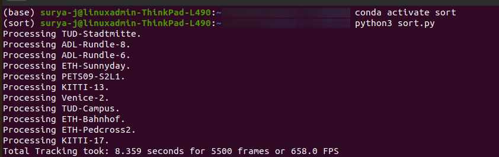

# SORT_resources
- C++ implementation of [SORT algorithm](https://arxiv.org/abs/1602.00763)
- SORT (Simple and online realtime tracking) is an online tracking algorithm where only detections from the previous and the current frame are presented to the tracker.
- `Kalman Filter + Hungarian algorithm` integral for  the algorithm

- The repo uses [Eigen library](https://eigen.tuxfamily.org/index.php?title=Main_Page) for matrix operations and [hungarian algorithm](https://github.com/suryajayaraman/hungarianAlgorithm) implementation
- [sort.py](scripts/sort.py) from [official repo](https://github.com/abewley/sort) is the reference python implementation for this repo. Check the original repo on how to run the python script.
 

### Reference Folder Structure
projectRoot/
    
    - data/
        train/
            ADL-Rundle-6/
                det/det/txt
            ADL-Rundle-8/
                det/det.txt
            .....

    - mot_benchmark
        train/
            ADL-Rundle-6/
                det/det/txt
                gt/gt.txt
                img1/
                    000001.jpg
                    000002.jpg
                    ......

- The `data/` folder contains necessary bounding box information for all frames in all scenarios
- The `mot_benchmark/` folder contains corresponding 
camera frames and is optional (~1.5GB download size)

### Requirements
The code was developed on Ubuntu 20.04 LTS OS with
- g++ 9.4.0
- cmake 3.16.3
- Eigen 3.3
- OpenCv 

### python script runtime speed

### References
- [SORT original paper](https://arxiv.org/abs/1602.00763)
- [SORT official github implementation](https://github.com/abewley/sort)
- [SORT cpp implementation](https://github.com/yasenh/sort-cpp)
- [SORT python implementation with importance to reidentification](https://github.com/danbochman/SORT)
